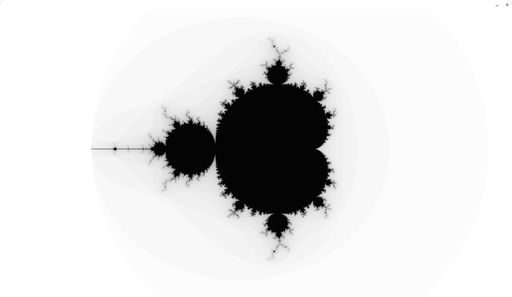

# Mandelbrot set visualiser

This project lets you interactively explore the mesmerizing **Mandelbrot set**, a mathematical fractal known for its complex and self-similar patterns.


The project was tested on AMD Ryzen 7 5700U on Linux Mint 21.3

## Features
- 4 types of Mandelbrot set calculation methods: **primitive**, using **SIMD** instructions, using **Vectorising without SIMD**, using C++ **operators overload**
- 3 palette types: **parity-based**, **linear gradient** and **animated**
- Benchmark current calculation method

## Controls
### Mouse
- **Pan**: Click and hold the left mouse button, then drag to pan the view.
- **Zoom**:
    - Scroll up with the mouse wheel to zoom in
    - Scroll down with the mouse wheel to zoom out
### Keyboard
- **Move**: `W` `A` `S` `D`
- **Switch palette**: `1` `2`
- **Switch calculation method**: `Enter`
- **Toggle debug info**: `L`
- **Run benchmark**: `B`
- **Exit**: `Escape`

## System Requirements
Your CPU must support **at least** AVX2.

To check on Linux if your processor supports AVX2, enter this in the terminal:
```
if [ $(grep -o -c 'avx2' /proc/cpuinfo) -ge 1 ]
then
    echo "Your CPU supports AVX2"
else
    echo "Your CPU DOESNT'T support AVX2"
fi
```
## Building
### Prerequisites
Dependencies:
- `Make` - build automation tool
- `SDL2` - cross-platform, open-source development library
- `SDL2_ttf` - extension library for SDL2 that specifically deals with font rendering

On `Ubuntu` you can install them with:
```
sudo apt-get install make libsdl2-dev libsdl2-ttf-dev
```
If you are using other Linux distributions you can see how to install them on the internet

### Installation
You can simply paste the following code into the terminal.
```
git clone git@github.com:IBIBENDUM/Mandelbrot.git
cd Mandelbrot
make build
```

(Optional) Before running the program, look at the [report on this project](Report/Mandelbrot.pdf)

Now to run program execute `make run`.

## Future Features
- Window resizing is not supported at the moment, so if you want to do it, change in the file `Includes/mandelbrot_config.h` constants `WINDOW_HEIGHT` and `WINDOW_WIDTH`
